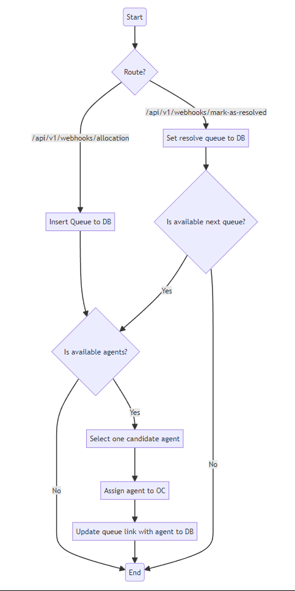
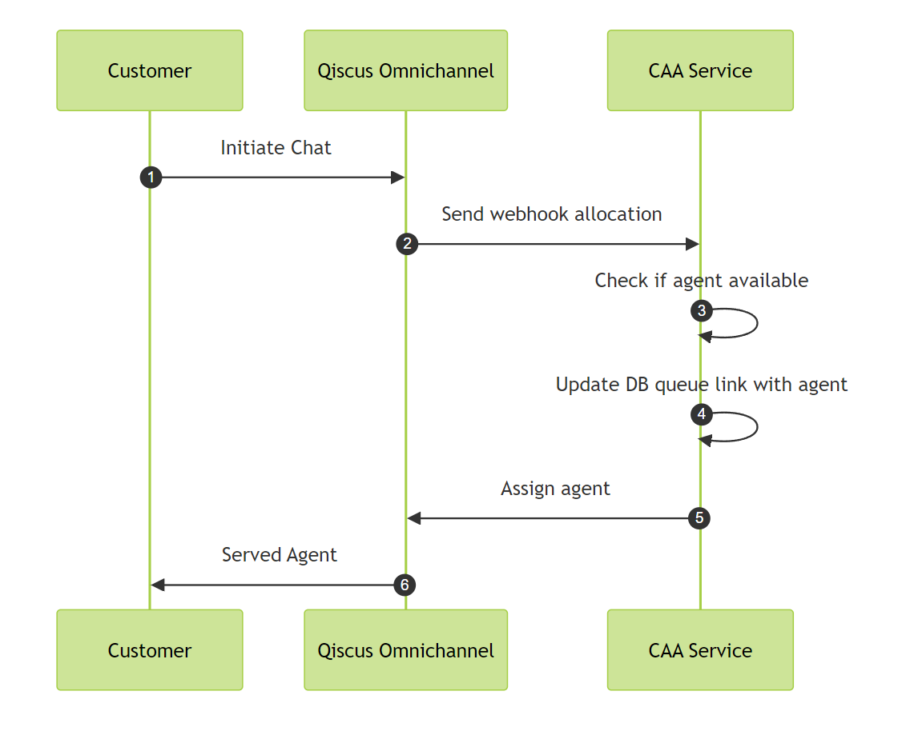
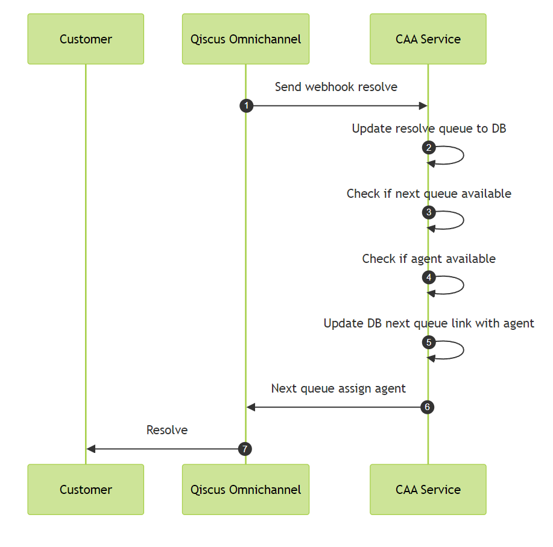
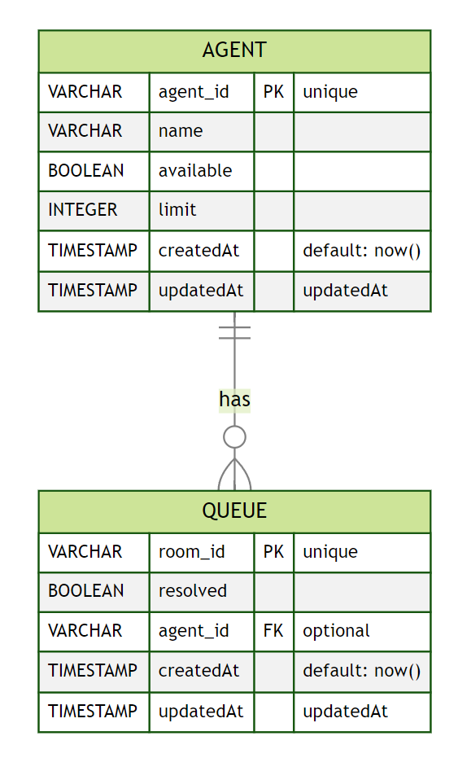

<div align="center" style="padding-bottom: 20px">
    <h1>Custom Agent Allocation</h1>
    
    
</div>

## Description:

This is a backend service designed to support custom agent allocation with a limit on the number of queues each agent can handle. It utilizes a FIFO queue to ensure fair distribution of tasks among agents.

## Flowchart:



## Sequence Allocation:



## Sequence Resolve:



## Used Frameworks, libraries, tools, databases:

- ExpressJS + Prisma + PostgreSQL

## Database schema:



## Clone and Setup Development

```shell
git clone 
```

```shell
cp .env.example .env 
```

## Installation

```bash
$ npm install install
```

```bash
$ npx prisma migrate dev
```

```bash
$ npm run dev
```

## Installation using Docker

Create docker-compose.yml file and fill environment

```bash
cp docker-compose.yml.example docker-compose.yml
```

Start the App

```bash
docker compose up
```